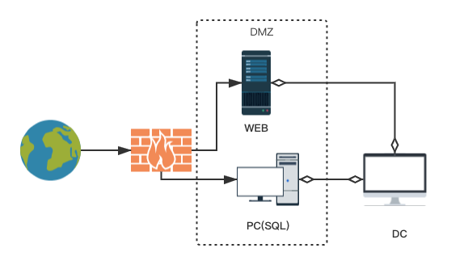
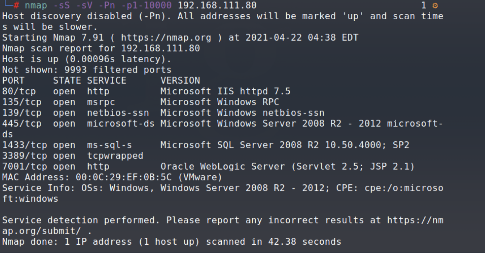
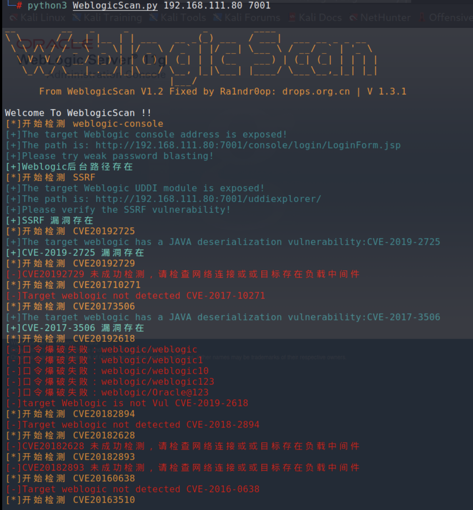
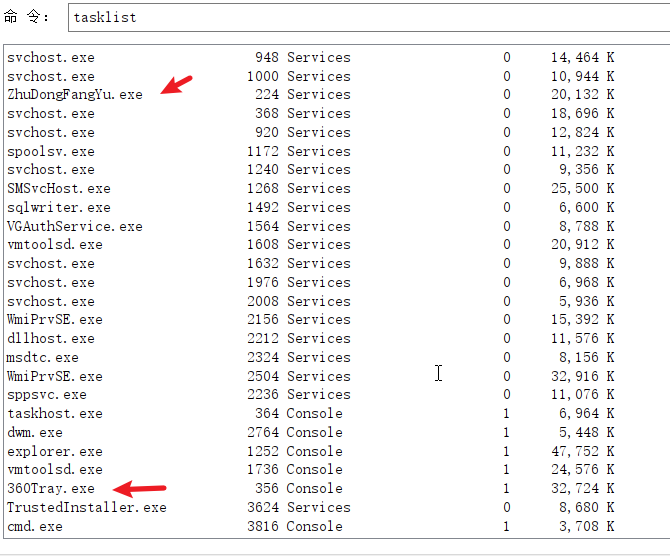
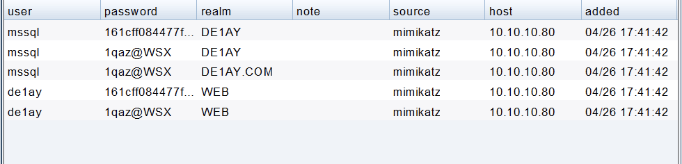
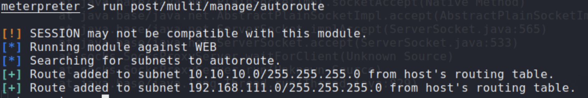

# VulnStack2

### 环境配置

DMZ区：WEB（123456@q）

内网：DC（1qaz@WSX）、PC（1qaz@WSX）

其中WEB和PC配置双网卡，即仅主机模式和外网卡（nat或桥接模式），DC仅主机模式

tips：密码未知破解https://jingyan.baidu.com/article/6079ad0e97f48828ff86dbe8.html

网络拓补：

DC（win2012）：10.10.10.10		PC（win7）：192.168.111.201｜10.10.10.201

WEB（win2008）：192.168.111.80｜10.10.10.80

攻击机（kali）：192.168.111.128 		windows：192.168.111.129

拓补图：

web服务：weblogic			pc：MSSQL

### 探测/web打点

**1、**web主机nmap扫描，发现iis，weblogic，mssql

利用工具扫描weblogic，发现两个反序列化

利用反序列化工具进行利用，执行命令探测账户和进程情况，发现360主动防御

普通的powershell执行返回话肯定不行，这里使用msf的mshta模块，直接使用cs的mshta插件反不回来，先反到msf，再用exploit/windows/local/payload_inject模块反一个cs的beacon。

**2、**提权及内网信息探测

经过查看，机器为winServer2008 r2 x64版本，内网ip：192.168.111.80和10.10.10.80；使用常见提权模块，最后使用ms15_051提权插件提权成功。

该主机常见的net  user /domain都被做了限制无法访问，但是能看见域控名：de1ay.com，通过ping de1ay.com确定域控ip：10.10.10.10

跑了下mimikatz，捕获账号密码：

**下面进行内网其他主机信息探测：**

meterpreter中使用post/multi/manage/autoroute模块将msf带入内网，同时加入内网两个网段的路由：

msf使用windows/gather/arp_scanner模块探测存活主机，分别探测两个网段：

两个网段存活主机如下：

| 192.168.111.80（web） |
| :-------------------: |
| 192.168.111.201（PC） |
|   10.10.10.10（DC）   |
|  10.10.10.80（web）   |
|  10.10.10.201（PC）   |

